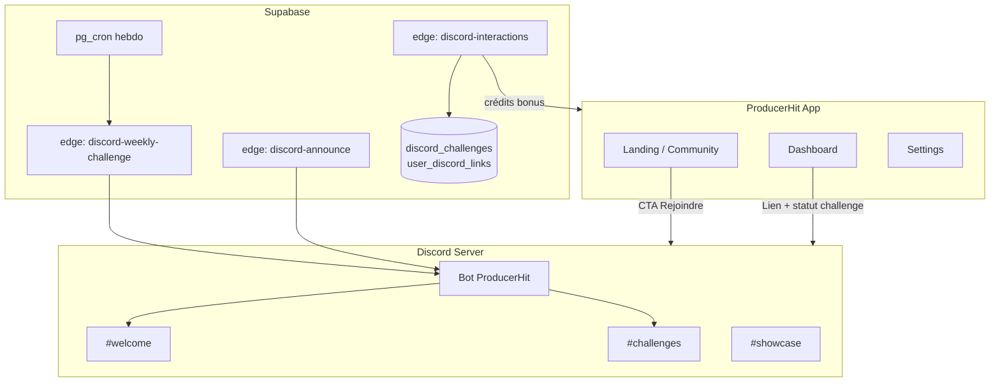

# Plan Discord automatisé — ProducerHit (A → Z)

Objectif : lancer une communauté Discord active (welcome, rôles, challenges hebdo, annonces, récompenses crédits) avec **un minimum d’intervention manuelle** — idéalement une seule session de setup Discord, puis tout le reste géré par code + déploiements.

---

## Ce que tu fais une seule fois (~10 min)

Discord ne permet pas de créer un bot sans compte humain. Une seule session suffit :

| Étape | Action | Qui |
|-------|--------|-----|
| 1 | Créer une app sur [Discord Developer Portal](https://discord.com/developers/applications) | Toi |
| 2 | Bot → Reset Token → copier le token | Toi |
| 3 | OAuth2 → URL Generator → scopes `bot` + `applications.commands`, permissions : Manage Roles, Send Messages, Embed Links, Read Message History | Toi |
| 4 | Inviter le bot sur ton serveur ProducerHit | Toi |
| 5 | Me transmettre (ou coller dans Supabase Secrets) : `DISCORD_BOT_TOKEN`, `DISCORD_GUILD_ID`, IDs des channels `#welcome`, `#announcements`, `#challenges`, `#showcase` | Toi |

**Après ça, je m’occupe de tout** : code, migrations, cron, déploiement edge functions, liens dans l’app.

---

## Architecture cible



---

## Phase 1 — Bot & infra (semaine 1)

### 1.1 Service bot (hébergé)

**Option recommandée** : worker Supabase Edge + Discord REST API (pas besoin de process 24/7 pour v1).

- `supabase/functions/discord-bot/` — helpers REST (send message, embed, add role)
- Secrets Supabase :
  - `DISCORD_BOT_TOKEN`
  - `DISCORD_GUILD_ID`
  - `DISCORD_CHANNEL_WELCOME`
  - `DISCORD_CHANNEL_ANNOUNCEMENTS`
  - `DISCORD_CHANNEL_CHALLENGES`
  - `DISCORD_CHANNEL_SHOWCASE`

### 1.2 Welcome automatique

- Trigger : webhook Discord `GUILD_MEMBER_ADD` → `discord-interactions` edge function
- Message embed : règles courtes, lien `/community`, lien pricing parrainage
- Rôle auto `@Membre` à l’arrivée

### 1.3 Rôles par plan (optionnel v1.1)

- Lier compte ProducerHit ↔ Discord via OAuth2 Discord (scope `identify`) — table `user_discord_links`
- Webhook Stripe `customer.subscription.updated` → sync rôle `@Pro`, `@Studio`, `@Plus`
- Downgrade → retrait rôle sous 24h

### 1.4 Liens dans l’app

| Emplacement | Contenu |
|-------------|---------|
| Footer Landing / Pricing | « Rejoindre Discord » |
| `/community` | Bandeau + UTM `?utm_source=discord` |
| Dashboard promo billboard | Challenge de la semaine + lien direct |
| Settings | « Connecter Discord » + statut |

Fichiers à toucher : `Navbar.tsx`, `LandingCommunityRail.tsx`, `communityHub.ts`, `growthLinks.ts`.

---

## Phase 2 — Challenges hebdo 100 % auto (semaine 2)

### 2.1 Schéma DB

```sql
-- migration 051_discord_challenges.sql
create table discord_weekly_challenges (
  id uuid primary key default gen_random_uuid(),
  week_key text not null unique, -- ex. 2026-W23
  theme_fr text not null,
  theme_en text not null,
  genre_tag text,
  bpm_range text,
  starts_at timestamptz not null,
  ends_at timestamptz not null,
  discord_message_id text,
  created_at timestamptz default now()
);

create table discord_challenge_entries (
  id uuid primary key default gen_random_uuid(),
  challenge_id uuid references discord_weekly_challenges(id),
  user_id uuid references auth.users(id),
  loop_id uuid references loops(id),
  discord_message_id text,
  votes int default 0,
  created_at timestamptz default now(),
  unique(challenge_id, user_id)
);
```

### 2.2 Génération du thème (sans toi)

Cron **chaque lundi 09:00 UTC** (`pg_cron`) → edge `discord-weekly-challenge` :

1. Tirer un thème depuis le catalogue genres ProducerHit (`promptBuilder` / genres étendus)
2. Insérer ligne `discord_weekly_challenges`
3. Poster embed dans `#challenges` avec :
   - Thème FR/EN
   - Règles (1 soumission / user, loop public obligatoire)
   - Lien deep `producerhit.com/community?challenge=2026-W23`
   - Deadline dimanche 23:59
4. Épingler le message

**Aucune rédaction manuelle** — rotation algorithmique + blacklist des thèmes récents (4 semaines).

### 2.3 Soumission depuis l’app

- Bouton « Participer au challenge » sur une loop publique
- Edge function vérifie : plan payant OU free avec ≥1 gen ce mois, loop `is_public`, pas déjà inscrit
- Post automatique dans `#showcase` avec cover + lien public loop
- Réaction 🎵 pour vote communautaire (compteur via cron ou bot poll)

### 2.4 Clôture & gagnant (dimanche auto)

Cron **dimanche 22:00 UTC** :

1. Compter votes (réactions Discord ou votes in-app)
2. Annoncer gagnant dans `#announcements`
3. Créditer bonus via RPC existante (`grant_bonus_credits` ou équivalent parrainage)
4. Préparer embed « Challenge suivant lundi »

Récompenses proposées :

| Place | Crédits |
|-------|---------|
| 1er | +30 gen |
| 2e | +15 gen |
| 3e | +10 gen |
| Participation (≥1 entry) | +3 gen (cap 1/semaine) |

---

## Phase 3 — Annonces produit (auto)

Edge `discord-announce` appelée par :

- **Deploy Vercel** (GitHub Action post-deploy) — « Nouvelle version live »
- **Stripe webhook** — milestones internes (optionnel, off par défaut)
- **Cron mensuel** — stats communauté (loops publics, remixes)

Template embed standard — pas de rédaction manuelle.

---

## Phase 4 — Interactions bot (slash commands)

Enregistrer via Discord API (une fois au deploy) :

| Commande | Action |
|----------|--------|
| `/challenge` | Affiche le challenge en cours + lien app |
| `/link` | OAuth ProducerHit → associe compte |
| `/credits` | Affiche solde (si compte lié) |
| `/rules` | Règles + lien `/legal#commercial-license` |

Handler : `discord-interactions` edge (verify Discord signature).

---

## Phase 5 — Observabilité

- Logs Supabase `get_logs` sur les 4 edge functions Discord
- Table `discord_bot_events` (type, payload, ok, error) pour debug
- Alert email si cron challenge échoue 2 semaines de suite

---

## Déploiement — checklist agent (moi)

Quand tu m’auras donné les secrets Discord :

- [ ] Migration `051_discord_challenges.sql`
- [ ] Edge functions : `discord-bot`, `discord-interactions`, `discord-weekly-challenge`, `discord-announce`
- [ ] Cron pg_cron lundi + dimanche
- [ ] Secrets Supabase
- [ ] Liens UI (Landing, Community, Dashboard, Settings)
- [ ] RPC crédits challenge
- [ ] GitHub Action post-deploy (optionnel)
- [ ] Deploy edge + push `main`

**Temps estimé implémentation** : 2–3 sessions agent après réception du token.

---

## Ce qui reste manuel (volontairement minimal)

| Fréquence | Tâche | Pourquoi |
|-----------|-------|----------|
| Une fois | Créer app Discord + inviter bot | Contrainte Discord OAuth |
| Rare | Modérer un signalement grave | Légal / safety — pas automatisable |
| Optionnel | Ajuster récompenses crédits | Business decision |

Tout le reste (thèmes, posts, clôture, crédits, annonces deploy) est **automatisé**.

---

## Prochaine action pour toi

Envoie-moi (message privé ou Supabase Secrets) :

```
DISCORD_BOT_TOKEN=...
DISCORD_GUILD_ID=...
DISCORD_CHANNEL_WELCOME=...
DISCORD_CHANNEL_ANNOUNCEMENTS=...
DISCORD_CHANNEL_CHALLENGES=...
DISCORD_CHANNEL_SHOWCASE=...
```

Réponds **« go discord »** et j’enchaîne l’implémentation Phase 1 + 2 sans autre question.
